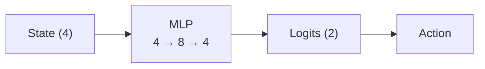
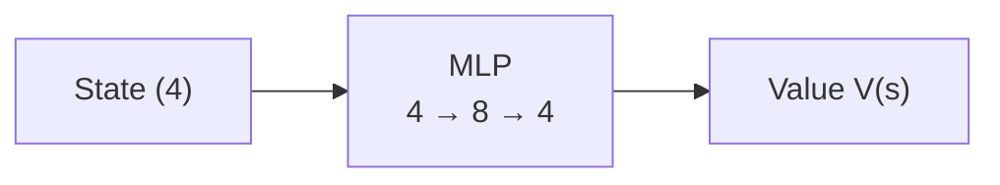

## 1. Policy Gradient with Baseline 이론

이론과 구현 모두 OpenAI의 [Spinning Up in Deep Rl](https://spinningup.openai.com/en/latest/spinningup/rl_intro3.html#baselines-in-policy-gradients)을 참고하였습니다.

그동안 gradient를 계산하기 위해 사용했던 식은 아래와 같습니다.

$$\hat{g} = \frac{1}{|\mathcal{D}|} \sum_{\tau \in \mathcal{D}} \sum_{t=0}^{T} \nabla_{\theta} \log \pi_{\theta}(a_t |s_t) R(\tau),$$

여기서 $$R(\tau)$$ 부분을 다른 식으로 바꿀 수 있습니다. 그 이유는 다음과 같습니다.

확률분포는 다음과 같은 성질을 갖습니다.

$$
\int_x P_{\theta}(x) = 1.
$$

따라서 양변에 그래디언트를 취하게 되면 어떤 확률분포의 그래디언트값은 0이 됩니다.

$$\nabla_{\theta} \int_x P_{\theta}(x) = \nabla_{\theta} 1 = 0.$$

그리고 여기서 log derivative trick을 사용하면 아래와 같은 식을 얻을 수 있습니다.

$$
\begin{aligned}
0&=\nabla_\theta\intop_{x}{P_\theta(x)}\\
&=\intop_x{\nabla_\theta P_\theta(x)}\\
&=\intop_x{P_\theta(x)\nabla_\theta \log P_\theta(x)}\\
\therefore &0=\underset{x\sim P_\theta}{\mathbb{E}}\left[\nabla_\theta \log P_\theta(x)\right]
\end{aligned}
$$

이 성질을 목적함수의 gradient 계산에 직접 적용할 수 있습니다.

$$\underset{a_t\sim\pi_\theta}{\mathbb{E}}\left[\nabla_\theta \log\pi_\theta(a_t|s_t)b(s_t)\right].$$

위의 식에서 로그확률의 그래디언트 기댓값이 0이 되기 때문에 다음과 같이 변형할 수 있습니다.

$$\nabla_\theta J(\pi_\theta)=\underset{\tau\sim\pi_\theta}{\mathbb{E}}\left[\sum\limits_{t=0}^{T}{\nabla_\theta \log\pi_\theta(a_t|s_t)}\left(\sum\limits_{t'=t}^{T}{R(s_{t'},a_{t'},s_{t'+1})-b(s_t)}\right)\right].$$

이러한 방식으로 사용되는 함수 $$b$$ 를 baseline이라고 부릅니다. baseline은 $$s_t$$에만 의존해야합니다. 그리고 $$b(s_t) = V^{\pi}(s_t)$$ 의 형태로 사용하는 것이 일반적이라고 합니다.
이때 가치함수 $$V$$ 는 정확히 알 수 없고 정책을 학습시키는 동시에 학습됩니다. 딥러닝을 사용하는 경우에는 Return과 $$V$$ 의 값을 MSE를 통해 학습됩니다.

### Advantage

Monte Carlo Return $$G_t$$와 Value Network의 예측값을 이용하여

$$\hat A_t=G_t-V_\phi(s_t)$$

를 계산합니다. 이 값은 Advantage Function

$$A^\pi(s_t,a_t)=Q^\pi(s_t,a_t)-V^\pi(s_t)$$

의 sample estimate로 사용할 수 있습니다.

Advantage Function은 특정 상태에서 특정 행동을 선택했을 때의 가치가 해당 상태에서 정책을 따랐을 때의 평균적인 가치보다 얼마나 높은지를 나타내는 지표입니다.

이와 같이 Value Function을 baseline으로 사용하여 Return 대신 Advantage의 추정값을 사용하면 정책 gradient의 variance를 줄일 수 있습니다.


## 2. 구현

전체 코드는 [이곳에서](https://github.com/jihoAi/RL_study/blob/main/PolicyGradientwithBaseline.ipynb) 볼 수 있습니다.

### Policy & Value Network

baseline을 구현하기 위해서는 Policy Network와 Value Network를 학습시켜야합니다.

Policy Network의 구조는 다음과 같습니다.


Value Network의 구조는 다음과 같습니다.



optimizer는 Adam을 사용했고 학습률은 0.008을 적용했습니다. Activaton은 ReLU를 사용하였습니다.

```python
def compute_policy_loss(self,log_probs,advantage):
  return -(log_probs * advantage.detach()).mean()

def compute_value_loss(self,advantage):
  return (advantage**2).mean()
```

위의 코드에서 baseline은 $$V^\pi(s_t)$$ 입니다. 그리고 $$G_t-V^\pi(s_t)$$를 Advantage의 추정량으로 사용하였습니다..
policy loss에서 Advantage 부분은 꼭 detach를 해주어야합니다. 그렇지 않으면 backpropagation을 통해서 Value Network를 의도치 않게 업데이트하게 됩니다.
Value는 Return을 타겟으로 MSE를 통해 학습시킵니다.

## 3. 결과

학습결과는 아래와 같습니다


## 4. 비교 실험

baseline을 사용한 에이전트와 사용하지 않은 에이전트의 학습양상을 서로 비교하여보겠습니다.
비교를 위해서 둘 다 학습률은 0.003을 사용했고 50번 파라미터를 업데이트하였습니다. 그리고 시드는 42로 고정하였습니다.
랜덤 시드만 고정하는 정도로는 강화학습의 학습과정에서의 우연성을 무시할 수는 없지만 참고 정도로 사용하면 될 것 같습니다.


baseline을 사용하지 않은 에이전트는 총 5020 에피소드, 사용한 에이전트는 총 5040 에피소드를 학습하였습니다.
이번 실험에서는 baseline을 사용한 에이전트가 baseline을 사용하지 않은 에이전트보다 reward 변동이 상대적으로 작고 안정적인 학습 양상을 보였습니다.
다만 하나의 seed만 사용한 결과이므로 일반적인 성능 차이라고 단정하기는 어렵습니다.

