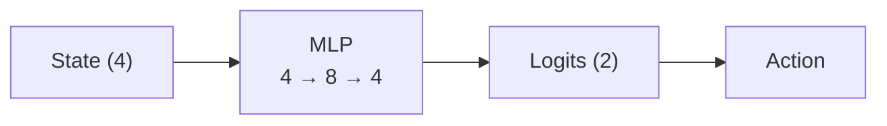
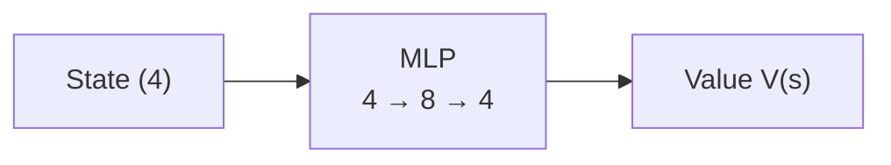

## 1. Policy Gradient with Baseline 이론

이론과 구현 모두 OpenAI의 [Spinning Up in Deep Rl](https://spinningup.openai.com/en/latest/spinningup/rl_intro3.html#baselines-in-policy-gradients)을 참고하였습니다.

그동안 gradient를 계산하기 위해 사용했던 식은 아래와 같습니다.

$$\hat{g} = \frac{1}{|\mathcal{D}|} \sum_{\tau \in \mathcal{D}} \sum_{t=0}^{T} \nabla_{\theta} \log \pi_{\theta}(a_t |s_t) R(\tau),$$

여기서 $$R(\tau)$$ 부분을 다른 식으로 바꿀 수 있습니다. 그 이유는 다음과 같습니다.

확률분포는 다음과 같은 성질을 갖습니다.

$$
\int_x P_{\theta}(x) = 1.
$$

따라서 양변에 그래디언트를 취하게 되면 어떤 확률분포의 그래디언트값은 0이 됩니다.

$$\nabla_{\theta} \int_x P_{\theta}(x) = \nabla_{\theta} 1 = 0.$$

그리고 여기서 log derivative trick을 사용하면 아래와 같은 식을 얻을 수 있습니다.

$$
\begin{aligned}
0&=\nabla_\theta\intop_{x}{P_\theta(x)}\\
&=\intop_x{\nabla_\theta P_\theta(x)}\\
&=\intop_x{P_\theta(x)\nabla_\theta \log P_\theta(x)}\\
\therefore &0=\underset{x\sim P_\theta}{\mathbb{E}}\left[\nabla_\theta \log P_\theta(x)\right]
\end{aligned}
$$

이 성질을 목적함수의 gradient 계산에 직접 적용할 수 있습니다.

$$\underset{a_t\sim\pi_\theta}{\mathbb{E}}\left[\nabla_\theta \log\pi_\theta(a_t|s_t)b(s_t)\right].$$

위의 식에서 로그확률의 그래디언트 기댓값이 0이 되기 때문에 다음과 같이 변형할 수 있습니다.

$$\nabla_\theta J(\pi_\theta)=\underset{\tau\sim\pi_\theta}{\mathbb{E}}\left[\sum\limits_{t=0}^{T}{\nabla_\theta \log\pi_\theta(a_t|s_t)}\left(\sum\limits_{t'=t}^{T}{R(s_{t'},a_{t'},s_{t'+1})-b(s_t)}\right)\right].$$

이러한 방식으로 사용되는 함수 $$b$$ 를 baseline이라고 부릅니다. 그리고 $$b(s_t) = V^{\pi}(s_t)$$ 의 형태로 사용하는 것이 일반적이라고 합니다.

이때 가치함수 $$V$$ 는 정확히 알 수 없고 정책을 학습시키는 동시에 학습됩니다. 딥러닝을 사용하는 경우에는 Return과 $$V$$ 의 값을 MSE를 통해 학습됩니다.

그리고 이런 baseline을 이용하는 경우 정책의 gradient를 추정하는데 상당한 variance를 줄여준다고 합니다.

## 2. 구현

전체 코드는 [이곳에서]([https://github.com](https://github.com/jihoAi/RL_study/blob/main/PolicyGradientwithBaseline.ipynb)) 볼 수 있습니다.

baseline을 구현하기 위해서는 Policy Network와 Value Network를 학습시켜야합니다.

Policy Network의 구조는 다음과 같습니다.

Value Network의 구조는 다음과 같습니다.

optimizer는 Adam을 사용하였습니다.

